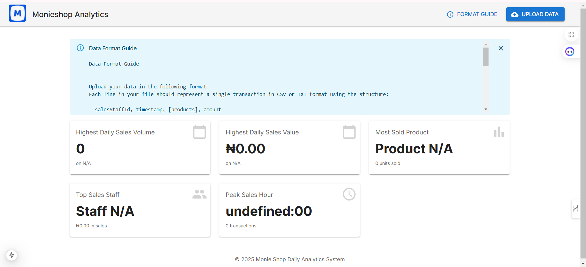
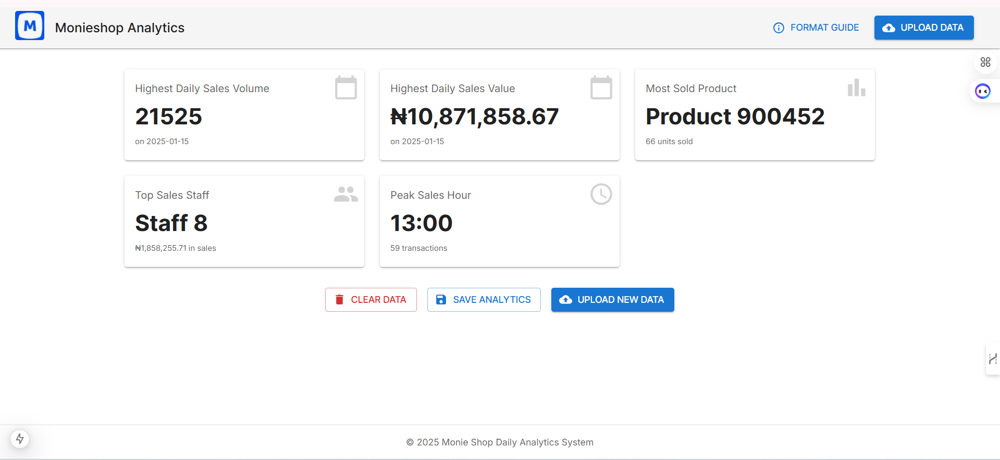

This is a [Next.js](https://nextjs.org) project bootstrapped with [`create-next-app`](https://nextjs.org/docs/app/api-reference/cli/create-next-app).
## User Interface before Upload

## User Interface After Upload


## Getting Started

First, run the development server:

```bash
npm install
# or
npm run dev
# or
yarn dev
# or
pnpm dev
# or
bun dev
```

Open [http://localhost:3000](http://localhost:3000) with your browser to see the result.

You can start editing the page by modifying `app/page.tsx`. The page auto-updates as you edit the file.

This project uses [`next/font`](https://nextjs.org/docs/app/building-your-application/optimizing/fonts) to automatically optimize and load [Geist](https://vercel.com/font), a new font family for Vercel.

## Learn More

To learn more about Next.js, take a look at the following resources:

- [Next.js Documentation](https://nextjs.org/docs) - learn about Next.js features and API.
- [Learn Next.js](https://nextjs.org/learn) - an interactive Next.js tutorial.

You can check out [the Next.js GitHub repository](https://github.com/vercel/next.js) - your feedback and contributions are welcome!

## Deploy on Vercel

The easiest way to deploy your Next.js app is to use the [Vercel Platform](https://vercel.com/new?utm_medium=default-template&filter=next.js&utm_source=create-next-app&utm_campaign=create-next-app-readme) from the creators of Next.js.

Check out our [Next.js deployment documentation](https://nextjs.org/docs/app/building-your-application/deploying) for more details.


## Overview

The **Monie Shop Analytics** application is designed to process sales data from a Monie Shop, allowing users to upload transaction files and view key metrics regarding sales performance. This application leverages React and Material-UI for a responsive and modern user interface.

## Features

- **File Upload**: Users can upload sales data in CSV or TXT format.
- **Metrics Display**: Key performance indicators such as highest daily sales volume, highest sales value, most sold product, top sales staff, and peak sales hour are displayed.
- **Data Format Guide**: A guide is provided to help users format their uploaded data correctly.
- **Save Analytics**: Users can save their analytics data locally for future reference.
- **Responsive Design**: The application is designed to be fully responsive, adapting to various screen sizes.

## Code Structure

### Imports

The application imports necessary libraries and components, including:

- **React**: For building the user interface.
- **Material-UI**: For UI components such as AppBar, Alert, Button, etc.
- **Icons**: Various Material-UI icons for visual representation.
- **Next.js Image**: For optimized image handling.

### Interfaces

Two TypeScript interfaces are defined to structure the metrics data:

- **Metrics**: Contains details about sales volume, value, most sold product, highest sales staff, and peak sales hour.
- **SavedAnalytics**: Represents the structure for saved analytics data.

### Components

1. **VisuallyHiddenInput**: A styled input component that is visually hidden but accessible for file uploads.
   
2. **MetricCard**: A reusable card component to display individual metrics with a title, value, subtitle, and icon.

### Main Component: `MonieshopAnalytics`

The main component of the application includes:

- **State Management**: 
  - `openSaveDialog`: Controls the visibility of the save dialog.
  - `prefix`: Stores the prefix for saved analytics.
  - `snackbar`: Manages feedback messages.
  - `originalFilename`: Holds the original filename of the uploaded data.
  - `metrics`: Stores calculated metrics from the uploaded data.
  - `isProcessing`, `isReading`, `error`, `showFormatGuide`: Manage loading states and error messages.

- **Functions**:
  - **handleClear**: Resets all metrics and clears the file input.
  - **handleFileUpload**: Handles file selection, reading, and processing the uploaded data.
  - **handleSave**: Saves the processed analytics data to local storage.
  - **handleCloseDialog**: Closes the save dialog.
  - **handleSnackbarClose**: Closes the snackbar feedback message.

- **UI Elements**:
  - **AppBar**: Contains the application title and buttons for uploading data and viewing the format guide.
  - **Loading Indicators**: Displays progress indicators while reading or processing data.
  - **Error Messages**: Shows alerts for errors encountered during file processing.
  - **Metrics Display**: Renders metrics using the `MetricCard` component.
  - **Action Buttons**: Provides options to clear data, save analytics, and upload new data.
  - **Save Dialog**: A dialog for entering a prefix and saving the analytics.
  - **Snackbar**: Displays feedback messages to the user.

### Data Format Guide

The application expects uploaded data in the following format:

- **salesStaffId**: The ID of the sales staff (number).
- **timestamp**: The date and time of the sale in ISO format (YYYY-MM-DDTHH:mm:ss).
- **products**: A list of product:quantity pairs enclosed in square brackets. Pairs are separated by a pipe (|).
- **amount**: The sale amount in Naira (can be a decimal).

**Example**:
8,2025-01-01T14:56:52,[149543:7|649302:7|45995:8|231096:2],30160.973
### Conclusion

The Monie Shop Analytics application provides a robust solution for analyzing sales data, helping users make informed decisions based on their sales performance. With a user-friendly interface and clear metrics, it enhances the overall experience of managing sales analytics.

## Getting Started

To run the application locally:

1. Clone the repository.
2. Install dependencies with `npm install` or `yarn install`.
3. Start the development server with `npm run dev` or `yarn dev`.
4. Open your browser and navigate to `http://localhost:3000`.

## License

This project is licensed under the MIT License. or Contact Yusuf Babatunde